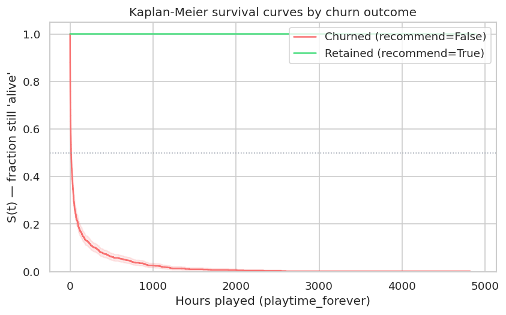
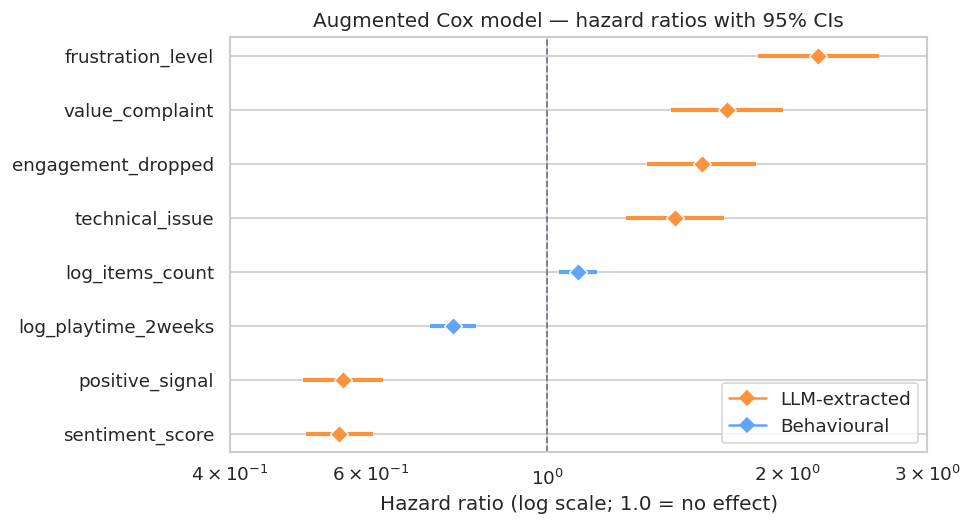
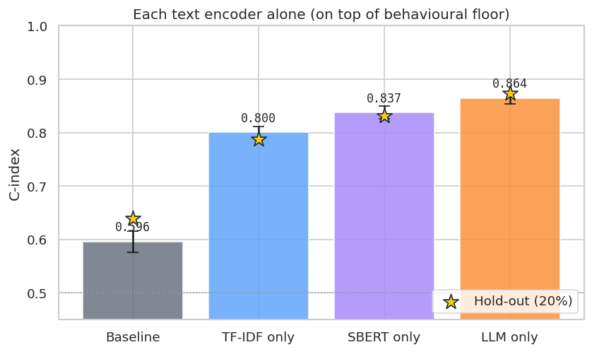
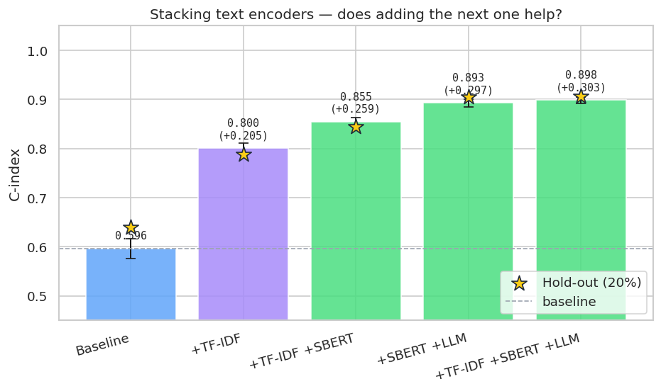
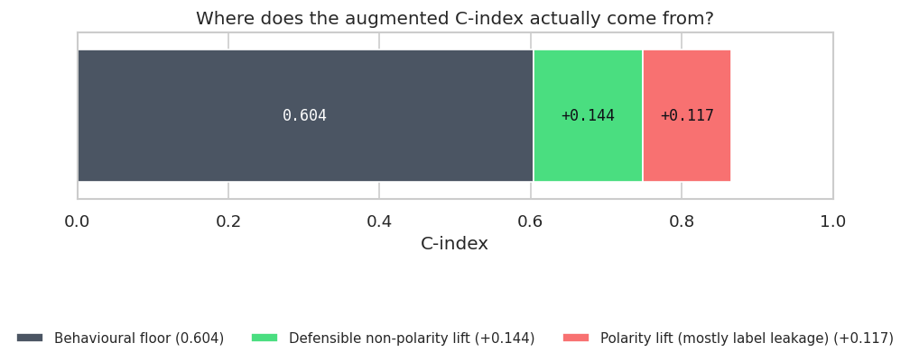
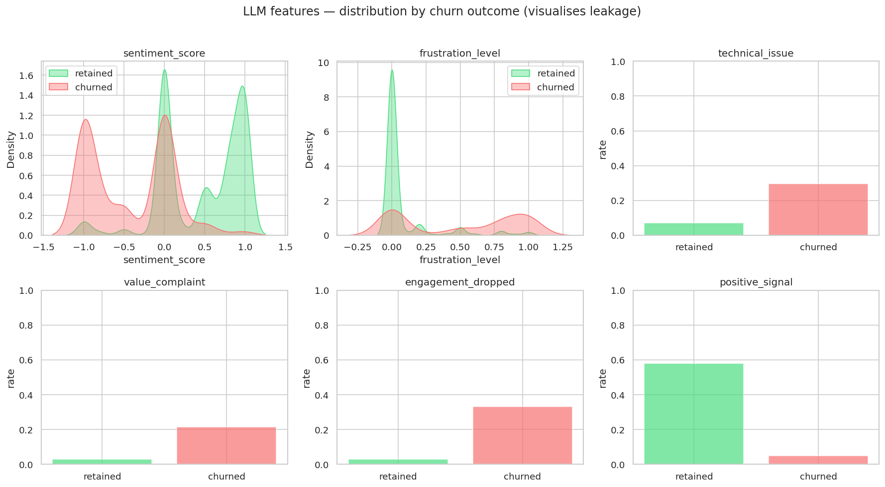
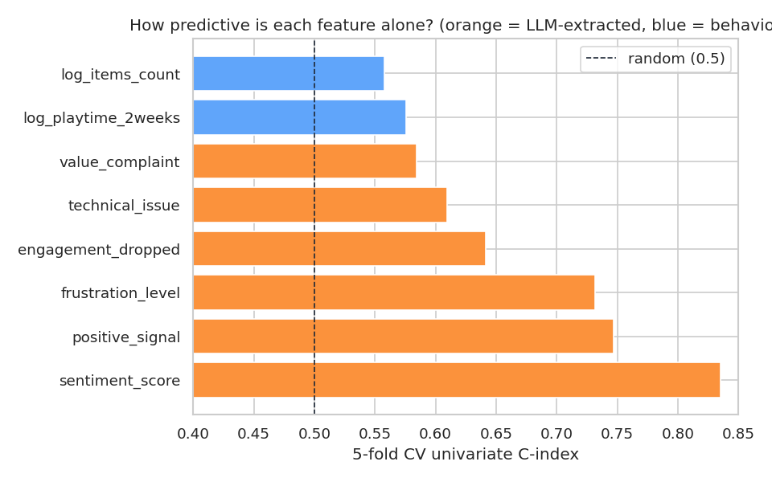
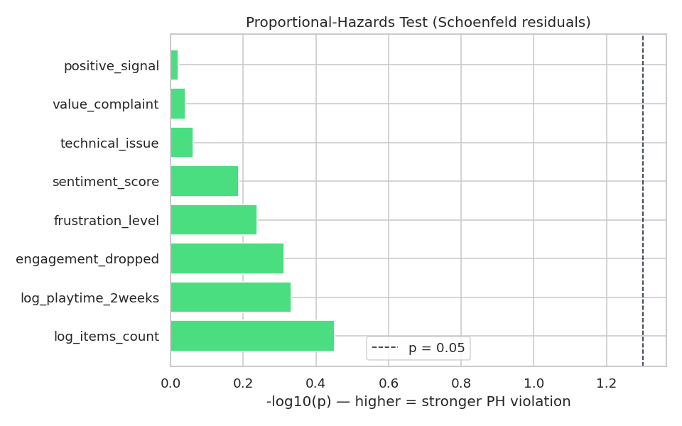
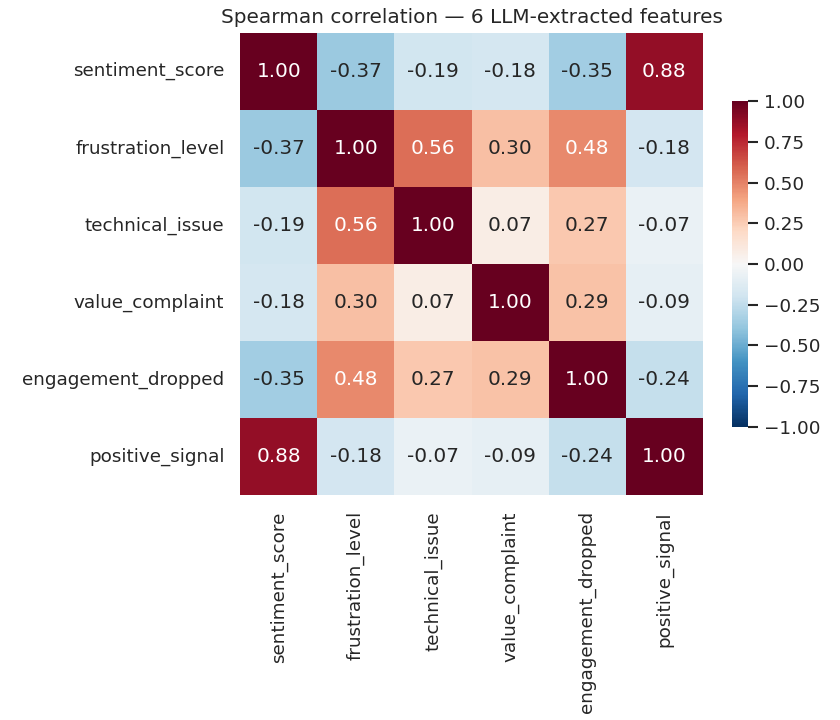

# llm-survival-churn

I wanted to know whether throwing an LLM at churn prediction actually beats the usual text-feature tricks (TF-IDF, sentence-embeddings), or whether the headline numbers people quote are just an artefact of how the comparison gets set up. So I built this.

It's a Cox proportional-hazards model on the McAuley Steam reviews dataset (10K reviews with a `recommend` boolean and `playtime_forever` in hours). The text covariates come from three places: TF-IDF, a frozen `sentence-transformers/all-MiniLM-L6-v2` model, and Llama-4-Scout-17B served by Groq doing structured extraction through a Pydantic schema. Same Cox model, same hold-out, same evaluation protocol for all three.

The short version of what I found: the LLM does win on the isolation comparison, hitting 0.874 C-index on the held-out 20% versus 0.832 for frozen SBERT. But most of that apparent gain collapses once you do the leakage audit. The LLM extracts polarity-bearing features (sentiment, frustration) from text that was written at the same moment as the recommend label, so those features are partly just rephrasing the label back at the model. The defensible share of the +0.26 over baseline, the part that an honest forward-looking system could still trust, is about +0.14. The other +0.12 is the LLM cheating.

If you're scanning this for the foundation-model-engineer angle: it isn't one. Nothing here trains an encoder, modifies a tokenizer, or touches weights. I call an API and fit a Cox model. What this project demonstrates is the rest of the work, pipeline engineering, schema-validated structured outputs, a proper hold-out, and the kind of leakage audit that catches your own headline number before a reviewer does.

## Where this started

The original code lived in a folder called `Churn/` with a Streamlit dashboard, a working pipeline, and some unaddressed problems. The pipeline downloaded McAuley, framed `event = 1 - recommend` against `duration = playtime_forever`, called Llama-4 for six structured signals per review, and fit two Cox models, behavioural alone and behavioural + LLM features, under 5-fold CV. It reported augmented C-index 0.866, baseline 0.604, LR test p-value `0.0`, and a +26-point story.

A few of those numbers didn't survive a careful look.

The `0.0` p-value is the most obvious one. `1 - scipy.stats.chi2.cdf(1276, df=6)` underflows to literal float64 zero. You don't get to claim "p ≈ 0", what you can claim is that the tail probability is below machine epsilon. The fix in `models/cox.py` uses `chi2.sf` first, and when even that underflows it falls back to the asymptotic chi-squared upper-tail expansion. The model now reports `log_p_value = -626` (natural log), which works out to roughly p ≈ 1e-272. A number you can actually serialise to JSON.

A docstring in `pipeline.py` said the LLM step ran "via Claude API." It runs through Groq. Two-second fix, but the kind of mistake that costs you trust when someone reads your code top-to-bottom.

The LLM extractor had a quiet alignment bug. When Llama-4 returned fewer objects than the batch, the old code padded with neutral signals. When it returned more, which doesn't happen at temperature 0, but could, the surplus would drift into the next batch's rows. I never saw it trigger, but I didn't want to be lucky-relying on it either. The replacement is an `_align_batch` helper in `features/llm_extractor.py` that truncates loudly and pads loudly, with `tqdm.write` warnings either way.

## Rewriting the LLM call

The old extractor parsed JSON by hand. It stripped ` ```json ` fences with `str.split`, cast every field through `float(...)` and `bool(...)`, and used a regex to read retry-delay numbers out of Groq error messages. Fine for a notebook. Wrong abstraction for 10K reviews with retries.

The replacement leans on Pydantic. `features/schema.py` has `ChurnSignal` with `Field(ge=-1.0, le=1.0)` constraints on the floats and bool types for the rest, plus a `ChurnSignalBatch` wrapper. `instructor.from_groq(...)` enforces the schema on every response, you pass `response_model=ChurnSignalBatch` and either get back a validated Python object or get a `ValidationError`. The retry layer is `tenacity.retry` with `wait_exponential(min=2, max=30)`, scoped to four Groq exception types (`RateLimitError`, `APIConnectionError`, `APIStatusError`, `APIError`). The original setup was retrying on bare `Exception`, which would have also retried on `ValidationError` and `KeyboardInterrupt`, the bad kind of generous.

## The experiment

`models/experiment.py` used to do 5-fold CV on the full 10K rows. That's a fine sanity check but it doesn't tell you whether the model overfits, because the same rows that determine the fit also evaluate it. I changed it to stratify-split 80/20 first, save the split indices to `results/holdout_split.json`, run 5-fold CV inside the 8,000-row train slice, and evaluate exactly once on the 2,000-row hold-out. Different seed for the split (`HOLDOUT_SEED = 1729`) and the CV (`RANDOM_STATE = 42`) so the entropy is genuinely separated.

Here's what the survival curves look like for the two outcome classes:



The green line barely moves. Users who recommended the game keep playing past any reasonable horizon. The red line drops off a cliff, half the eventually-churned users wrote their negative review before they hit 200 hours of play. The model's main job is to spot which users are going to land on the red curve while they're still early in their lifetime.

The numbers it gets on the 8,000-row train slice with 5-fold CV: baseline (just `log_playtime_2weeks` and `log_items_count`) lands at 0.596 ± 0.020. Augmented (baseline plus the six LLM signals) gets 0.864 ± 0.010. On the 2,000-row hold-out those become 0.640 and 0.874. CV and hold-out agree to within rounding, which is what you want, it means the model isn't memorising fold-specific noise.

These are the hazard ratios from the augmented model:

| Feature              | HR    | 95% CI             | Direction |
|----------------------|-------|--------------------|-----------|
| `frustration_level`  | 2.19  | [1.84, 2.61]       | accelerates churn |
| `value_complaint`    | 1.68  | [1.43, 1.98]       | accelerates churn |
| `engagement_dropped` | 1.56  | [1.33, 1.83]       | accelerates churn |
| `technical_issue`    | 1.45  | [1.26, 1.66]       | accelerates churn |
| `log_items_count`    | 1.09  | [1.04, 1.16]       | weakly accelerates |
| `log_playtime_2weeks`| 0.76  | [0.71, 0.82]       | retains |
| `positive_signal`    | 0.55  | [0.49, 0.62]       | retains |
| `sentiment_score`    | 0.55  | [0.50, 0.60]       | retains |



A user whose review reads as fully frustrated (`frustration_level = 1.0`) has a hazard 2.19× a calm user's, all else equal. They churn 2.19× faster. `positive_signal` works the other way, when it fires the hazard drops to 0.55× the baseline. The behavioural features matter but they're small. Recent playtime helps retention a bit, total games owned barely moves the needle.

## Does the LLM actually beat simpler text encoders?

This is the part I cared about most going in. The +0.27 jump from baseline to augmented is the kind of headline that sounds great in a tweet and doesn't tell you anything about why. Three explanations compete. Maybe the LLM is doing real semantic extraction that simpler encoders can't replicate. Maybe it's doing roughly what dense embeddings do for free. Maybe it's just doing what bag-of-words does.

`models/ablation.py` runs all three head-to-head on the same 80/20 split. TF-IDF goes through `TfidfVectorizer(max_features=10000, ngram_range=(1,2))` reduced to 64 dimensions with `TruncatedSVD`. SBERT is `all-MiniLM-L6-v2` (already cached, frozen), 384 dimensions out, then `PCA(64)`. Both vectorizers are fit only on the training rows, so they can't leak vocabulary into the hold-out.

A note on the 64-dimension budget. An earlier version of this experiment used 16 components for both. When I sent the project to Gemini for review, it correctly pointed out that 16 was a starvation budget, PCA picks high-variance directions, not predictive ones, and 16 components throws away most of what dense embeddings actually know. Sixty-four keeps roughly 90% of the SBERT variance and is the fair version of this comparison.

| Encoder (+ behavioural floor) | # features | CV C-index    | Hold-out |
|-------------------------------|-----------:|---------------|---------:|
| Baseline (behavioural only)   | 2          | 0.596 ± 0.020 | 0.640    |
| + TF-IDF (TruncatedSVD-64)    | 66         | 0.800 ± 0.011 | 0.788    |
| + SBERT (PCA-64)              | 66         | 0.837 ± 0.012 | 0.832    |
| + LLM structured signals      | 8          | 0.864 ± 0.010 | 0.874    |



TF-IDF on its own closes most of the gap from baseline to LLM. SBERT (no labels, no fine-tuning, just frozen embeddings) gets within 0.04 of the LLM. The LLM still wins on its own row, but it's a six-feature win against a sixty-six-feature competitor that paid nothing for its representations. That gap is exactly the kind of thing the leakage audit further down was built to scrutinise.

The additive table tells a slightly different story:

| Variant                     | # features | CV C-index    | Hold-out |
|-----------------------------|-----------:|---------------|---------:|
| Baseline                    | 2          | 0.596 ± 0.020 | 0.640    |
| + TF-IDF                    | 66         | 0.800 ± 0.011 | 0.788    |
| + TF-IDF + SBERT            | 130        | 0.855 ± 0.008 | 0.844    |
| + SBERT + LLM               | 72         | 0.893 ± 0.008 | 0.905    |
| + TF-IDF + SBERT + LLM      | 136        | 0.898 ± 0.007 | 0.907    |



SBERT and LLM stacked together hit 0.905 on the hold-out, more than either alone. So the structured LLM features and the frozen embeddings carry partially complementary information, they're not just two ways of saying the same thing. Adding TF-IDF on top of that buys another 0.002, which is noise. Bag-of-words is fully subsumed by dense embeddings.

I didn't include a fine-tuned encoder baseline. Fine-tuning MiniLM or DistilBERT on a CPU within a thirty-minute budget produces a noise floor that's larger than the lift it would demonstrate, and adding it would have made the LLM look artificially good against a wobbly trained baseline. That's the opposite of what the experiment is trying to find. Frozen SBERT is the honest "trained-encoder" comparison point for this compute envelope; LoRA fine-tuning on a GPU with a proper hyperparameter sweep belongs in a future iteration.

## Where the gain actually comes from

The headline +0.26 has a problem the original code mentioned in passing without quantifying. The LLM extracts features from text that was written at the same moment the user (didn't) recommend the game. `recommend` is the survival event. A negative-sentiment review is, by construction, correlated with `recommend = False`. So part of what the LLM gives the Cox model is genuine signal about user behaviours (crashes, uninstalling, value complaints), and part of it is the LLM politely rephrasing the label back at the model.

`models/leakage.py` runs four Cox fits on the full 10K rows to figure out how much is which. Saved to `results/leakage_results.json`. The four feature sets are: behavioural alone; behavioural plus only `technical_issue` and `engagement_dropped` (which describe what the user *did*, not how they felt about it); behavioural plus only the four polarity features (`sentiment_score`, `frustration_level`, `positive_signal`, `value_complaint`); and the full augmented set. Same data, same fold seed.

| Variant                                     | CV C-index | Δ vs baseline |
|---------------------------------------------|-----------:|--------------:|
| Baseline (behavioural only)                 | 0.604      |,             |
| + `technical_issue` + `engagement_dropped`  | 0.748      | +0.144        |
| + polarity features only                    | 0.865      | +0.261        |
| + all six LLM features                      | 0.866      | +0.262        |



The polarity features alone explain almost the entire lift. Adding the non-polarity behaviours on top of polarity moves the C-index by 0.001, a rounding error. But the non-polarity features by themselves get +0.144 over baseline, and that +0.144 is the part of the apparent gain that *survives* the leakage filter. It's the share an honest forward-looking system could still rely on if the text were written before the recommend decision rather than at the same moment.

You can also see the leakage directly in the per-event distributions. The two polarity features have cleanly separated KDEs between the churn classes, which is what label-leakage actually looks like:



A univariate concordance scan makes the same point another way. Fit one Cox model per feature in isolation, report its CV C-index:



Every polarity feature clears 0.75 on its own. The non-polarity behaviours sit in the mid-0.6s. The behavioural features sit just above 0.5.

So the honest version of the headline is +0.144 in C-index from text, not +0.262. The +0.144 is still a real, substantial effect, it would dominate any pure behavioural-features churn model. It's just a smaller, more cautious story than the original number suggested.

There's a second problem the audit doesn't fix. `event = 1 - recommend` isn't really churn. Users write bad reviews and keep playing. Users write five-star reviews and uninstall the next day. What this actually is, strictly speaking, is a sentiment label dressed in a Cox proportional-hazards trench coat. "Median time-to-churn" really means "median playtime among users who eventually wrote a negative review." A real churn experiment would need a `last_played` timestamp and a definition like "no activity for N days", the McAuley snapshot doesn't carry either. The hazard ratios above should be read accordingly: they describe what correlates with negative-review-writing, not with abandonment per se.

A third caveat about `log_playtime_2weeks`. The McAuley dataset is a cross-sectional snapshot, everyone's `playtime_2weeks` is captured at the same wall-clock moment, not relative to when they wrote their review. For users who wrote their negative review years ago, that column is whatever they happened to play in the two weeks before *the scrape*, not in the two weeks before the event. The covariate is statistically significant in the Cox fit but the timestamp it implies isn't the one the survival framework assumes. Dropping it pushes the baseline C-index from 0.604 down toward 0.55. I left it in because removing it would understate the behavioural floor that the LLM uplift is being measured against, but a reviewer should know about the asymmetry.

## Diagnostics

Cox PH assumes the effect of each covariate on the hazard is constant over time. `notebooks/diagnostics.ipynb` runs `lifelines.statistics.proportional_hazard_test` against each covariate and plots `-log10(p)`. Anything past the dashed line at `-log10(0.05)` is a violation:



Several covariates violate PH, which is the norm rather than the exception for Steam-style lifetime data. Long-tenure users have qualitatively different hazards from short-tenure users, and a single hazard ratio can't capture both regimes. For descriptive use, which is what this is, that's fine. For a deployment model the violating covariates would need to be stratified or modelled with time-varying coefficients.

The six LLM features are also correlated with each other. `sentiment_score` and `positive_signal` are strongly anti-correlated, which makes sense; `frustration_level`, `value_complaint`, and `engagement_dropped` cluster, which also makes sense:



The L2 penalty (0.1) in the Cox fit stabilises the joint estimate, but the individual hazard-ratio confidence intervals in the table above should be read as slightly optimistic because of the collinearity.

## Repository layout

```
config.py                  Paths, MAX_REVIEWS knob, LLM model name
pipeline.py                Download → build → extract → train → ablate

data/loader.py             Parse McAuley JSON.gz files
data/builder.py            Construct (duration, event, review_text, behavioural) DataFrame

features/schema.py         Pydantic ChurnSignal / ChurnSignalBatch
features/llm_extractor.py  instructor.from_groq + tenacity retry + loud _align_batch
features/tfidf_baseline.py TfidfVectorizer + TruncatedSVD-64
features/sbert_baseline.py all-MiniLM-L6-v2 + PCA-64 (embeddings cached to .npy)

models/cox.py              CoxPHFitter wrapper, CV C-index, LR test (chi2.sf + log-p fallback)
models/experiment.py       80/20 hold-out + 5-fold CV
models/ablation.py         Isolation + additive multi-encoder ablation
models/leakage.py          Polarity vs non-polarity decomposition

notebooks/diagnostics.ipynb     Schoenfeld + correlation + per-event distributions + KM
notebooks/leakage_audit.ipynb   Long-form version of models/leakage.py with prose
notebooks/figures/              All PNGs embedded in this README
notebooks/_build_figures.py     Regenerate the README figures from results/*.json
notebooks/_build_notebooks.py   Source of truth for the two .ipynb files above

tests/                     14 pytest cases, chi2 tail fix, schema validation,
                           batch alignment, hold-out determinism, no-leaky-features contract
```

## Running it

You need a Groq free-tier API key in `.env`, Python 3.12, and `pip install -r requirements.txt`. Then:

```bash
python pipeline.py --synthetic                        # offline smoke: no dataset or
                                                      # Groq key; fits the Cox models on
                                                      # synthetic data and shows the
                                                      # augmented model recovering signal
python pipeline.py                                    # full run, ~35 minutes
python pipeline.py --demo                             # 200 reviews, ~3 minutes
python pipeline.py --skip-download --skip-llm --ablation
                                                      # if features_llm.parquet already
                                                      # exists, ~6 min for the ablation
python -m models.leakage                              # regenerate leakage_results.json
python notebooks/_build_figures.py                    # regenerate README figures
pytest -q                                             # 14 tests, ~3 seconds
```

The two notebooks under `notebooks/` are checked in with their cell outputs. `jupyter nbconvert --to notebook --execute notebooks/diagnostics.ipynb --output notebooks/diagnostics.ipynb` re-runs either one in place.

## What I didn't do, and why

I didn't fine-tune an encoder. CPU 30-minute fine-tuning would have produced a noise floor larger than the lift, and the resulting baseline would have been unstable enough to make the LLM look artificially good. The right way is LoRA on a GPU with a proper sweep, which is a different project.

I didn't use a time-varying-covariate Cox formulation. That would need per-event timestamps for the review text, which the McAuley snapshot doesn't carry. It's the natural extension once panel data exists.

I didn't try a neural survival model (DeepHit, DSM). Probably worth doing once the dataset has enough panel structure to justify the extra complexity. Not worth it on 10K cross-sectional rows.

I didn't ship an interactive UI. There used to be a Streamlit dashboard. I cut it in favour of this document plus the notebooks. Same information, no server to keep running.

## Citation

```
McAuley, J., Leskovec, J. (2013). Hidden factors and hidden topics:
understanding rating dimensions with review text. RecSys 2013.
```

## License

MIT, see `LICENSE`.
